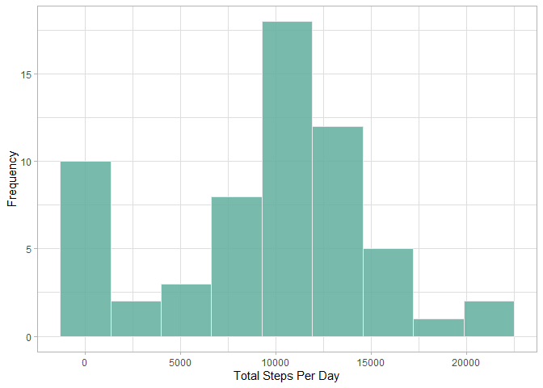
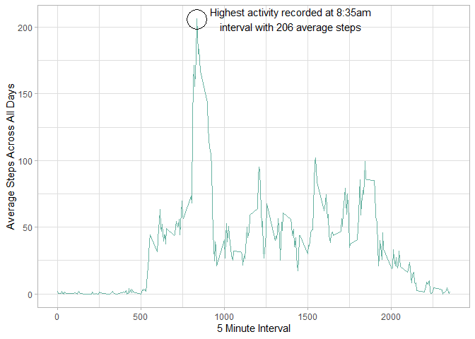
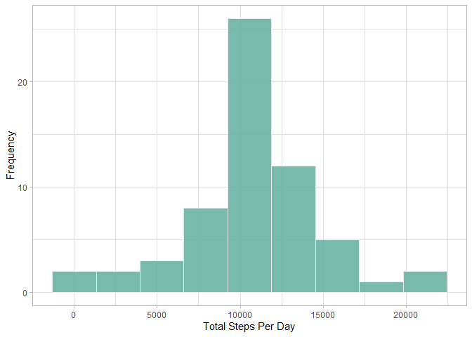
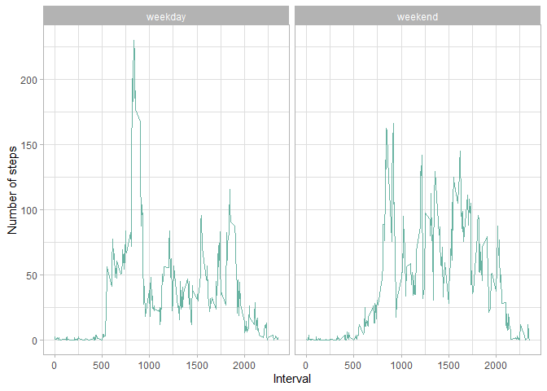

```r
library(dplyr)
library(lubridate)
library(ggplot2)
```


## Loading and preprocessing the data
Let's load the data and correctly format the date variable.

```r
data <- read.csv("activity.csv")
data$date <- ymd(data$date)
```


## What is mean total number of steps taken per day?
Let's group the data by date and calculate the sum of steps taken per day.

```r
grouped_by_date <- group_by(data, date)
summarized_data_date <- summarize(grouped_by_date, total_steps=sum(steps, na.rm = TRUE))
head(summarized_data_date)
```

```
## # A tibble: 6 x 2
##   date       total_steps
##   <date>           <int>
## 1 2012-10-01           0
## 2 2012-10-02         126
## 3 2012-10-03       11352
## 4 2012-10-04       12116
## 5 2012-10-05       13294
## 6 2012-10-06       15420
```

Let's draw up a histogram of the total number of steps taken per day.

```r
ggplot(summarized_data_date, aes(x=total_steps)) + geom_histogram(bins = 9, fill="#69b3a2", color="#e9ecef", alpha=0.9) + xlab("Total Steps Per Day") + ylab("Frequency") + theme_light()
```

<!-- -->

Let's have a look at the mean and median of the total number of steps taken per day.

```r
mean(summarized_data_date$total_steps)
```

```
## [1] 9354.23
```

```r
median(summarized_data_date$total_steps)
```

```
## [1] 10395
```


## What is the average daily activity pattern?
Let's draw a plot to have a look at the average daily activity pattern.

```r
grouped_by_interval <- group_by(data, interval)
summarized_data_interval <- summarize(grouped_by_interval, mean_steps=mean(steps, na.rm = TRUE))
ggplot(summarized_data_interval, aes(x=interval, y=mean_steps)) + geom_line(color="#69b3a2") + xlab("5 Minute Interval") + ylab("Average Steps Across All Days") + annotate(geom="point", x=835, y=206, size=10, shape=21, fill="transparent") + annotate(geom="text", x=1400, y=206, label="Highest activity recorded at 8:35am\ninterval with 206 average steps") + theme_light()
```

<!-- -->

As highlighted on the graph, it can be seen that the 8:35am interval on average contains the maximum number of steps.


## Imputing missing values
Let's have a look at the number of rows with missing values.

```r
sum(is.na(data$steps))
```

```
## [1] 2304
```

That's approximately 13% missing values.
Let's replace the missing values with the mean for that 5-minute interval.


```r
imputed_data <- read.csv("activity.csv")
missing_indexes <- which(is.na(imputed_data$steps))
for(index in missing_indexes){
    interval <- imputed_data[[index,3]]
    mean_steps_interval <- summarized_data_interval[summarized_data_interval$interval==interval,2][[1]]
    imputed_data[index,]$steps <- mean_steps_interval
}
```

Now let's plot a histogram of the total steps taken each day with the imputed data.


```r
imputed_grouped_by_date <- group_by(imputed_data, date)
imputed_summarized_data_date <- summarize(imputed_grouped_by_date, total_steps=sum(steps))
ggplot(imputed_summarized_data_date, aes(x=total_steps)) + geom_histogram(bins = 9, fill="#69b3a2", color="#e9ecef", alpha=0.9) + xlab("Total Steps Per Day") + ylab("Frequency") + theme_light()
```

<!-- -->

Let's have a look at the updated mean and median total number of steps taken per day.


```r
mean(imputed_summarized_data_date$total_steps)
```

```
## [1] 10766.19
```

```r
median(imputed_summarized_data_date$total_steps)
```

```
## [1] 10766.19
```

Comparing the 2 datasets, we can see that imputing missing values has increased the mean steps taken per day from 9,354 to 10,766. A significant rise of approximately 1500 steps.

## Are there differences in activity patterns between weekdays and weekends?

Let's create a new factor variable in the dataset with two levels – “weekday” and “weekend” indicating whether a given date is a weekday or weekend day.


```r
imputed_data <- mutate(imputed_data, day_type = ifelse(as.POSIXlt(date)$wday %in% c(0,6), "weekend", "weekday"))
imputed_data$day_type <- as.factor(imputed_data$day_type)
```

Let's draw a panel plot to look at the differences in activity patterns between weekdays and weekends.


```r
imputed_data <- group_by(imputed_data, interval, day_type)
summarized_data <- summarize(imputed_data, mean_steps=mean(steps))
ggplot(summarized_data, aes(x=interval, y=mean_steps)) + geom_line(color="#69b3a2") + facet_wrap(~ day_type) + xlab("Interval") + ylab("Number of steps") + theme_light()
```

<!-- -->

